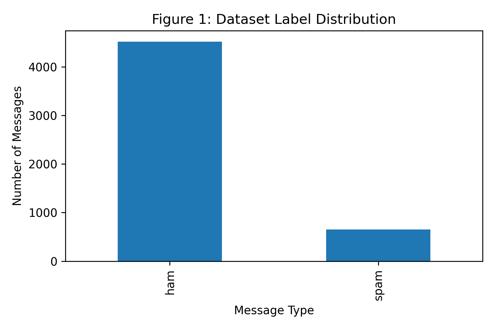
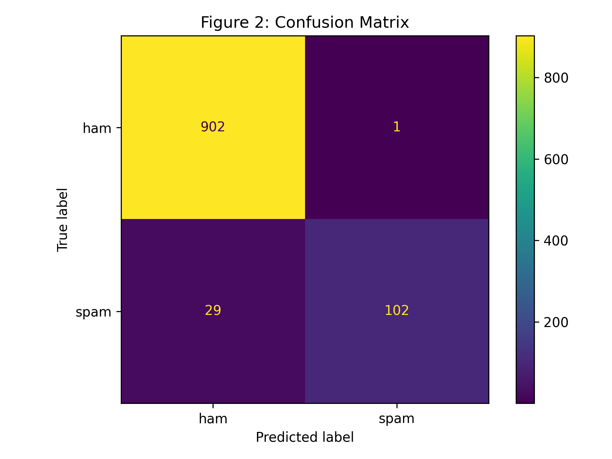
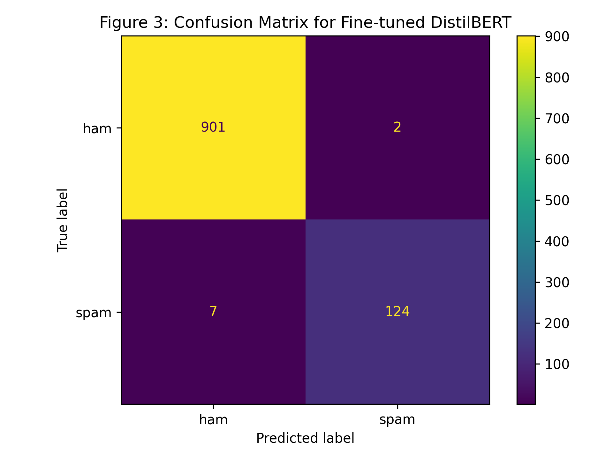
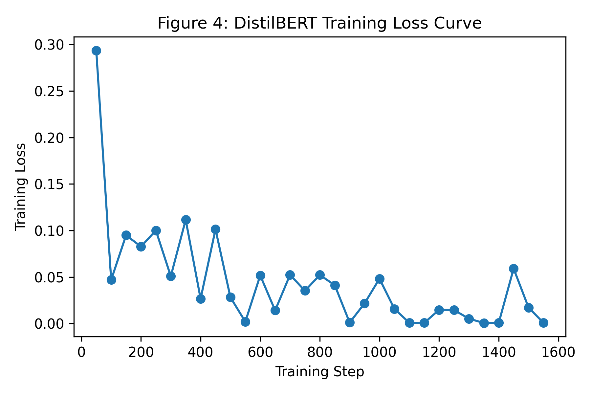

# SMS Spam Detection with TF-IDF, Naive Bayes, and DistilBERT

An end-to-end natural language processing project for classifying SMS messages as spam or ham. The repository compares a lightweight traditional machine learning baseline using TF-IDF with Multinomial Naive Bayes against a fine-tuned DistilBERT transformer model.

The project is structured for reproducibility and portfolio presentation: notebooks, dataset, evaluation outputs, figures, and the final report are all organized in clear folders.

## Project Highlights

- Built a complete SMS spam classification workflow from raw text data to model evaluation.
- Implemented and evaluated a TF-IDF + Multinomial Naive Bayes baseline.
- Fine-tuned `distilbert-base-uncased` for binary sequence classification.
- Compared models using accuracy, precision, recall, F1-score, confusion matrices, and training loss.
- Exported results and visualizations for reporting and review.

## Repository Structure

```text
.
|-- data/
|   `-- SMSSpamCollection.csv
|-- notebooks/
|   |-- distilbert_spam_detection.ipynb
|   `-- tfidf_naive_bayes_spam_detection.ipynb
|-- outputs/
|   |-- figures/
|   |   |-- figure1_label_distribution.png
|   |   |-- figure2_confusion_matrix.png
|   |   |-- figure3_distilbert_confusion_matrix.png
|   |   `-- figure4_distilbert_training_loss.png
|   `-- metrics/
|       |-- distilbert_results.csv
|       `-- tfidf_naive_bayes_results.csv
|-- reports/
|   |-- code_output_report.pdf
|   `-- project_report.docx
|-- requirements.txt
|-- LICENSE
`-- README.md
```

## Dataset

The dataset contains 5,572 SMS messages with two classes:

| Class | Count |
| --- | ---: |
| Ham | 4,825 |
| Spam | 747 |

The source file is included at `data/SMSSpamCollection.csv` and uses the common `v1` label and `v2` message format.

## Model Performance

| Model | Accuracy | Precision | Recall | F1-Score |
| --- | ---: | ---: | ---: | ---: |
| TF-IDF + Multinomial Naive Bayes | 0.9710 | 0.9903 | 0.7786 | 0.8718 |
| Fine-tuned DistilBERT | 0.9913 | 0.9841 | 0.9466 | 0.9650 |

DistilBERT achieved the strongest overall performance, especially on recall and F1-score, making it better suited for identifying spam messages that the baseline model missed.

## Visual Results

### Label Distribution



### TF-IDF + Naive Bayes Confusion Matrix



### DistilBERT Confusion Matrix



### DistilBERT Training Loss



## Getting Started

### 1. Clone the repository

```bash
git clone https://github.com/<your-username>/sms-spam-detection-nlp.git
cd sms-spam-detection-nlp
```

### 2. Create a virtual environment

```bash
python -m venv .venv
source .venv/bin/activate
```

On Windows:

```powershell
python -m venv .venv
.\.venv\Scripts\activate
```

### 3. Install dependencies

```bash
pip install -r requirements.txt
```

### 4. Run the notebooks

Open either notebook in Jupyter:

```bash
jupyter notebook
```

Recommended order:

1. `notebooks/tfidf_naive_bayes_spam_detection.ipynb`
2. `notebooks/distilbert_spam_detection.ipynb`

## Technologies Used

- Python
- pandas
- NumPy
- scikit-learn
- Matplotlib
- PyTorch
- Hugging Face Transformers
- Hugging Face Datasets
- Jupyter Notebook

## Suggested GitHub Repository Details

- Repository name: `sms-spam-detection-nlp`
- Description: `SMS spam classification using TF-IDF, Naive Bayes, and fine-tuned DistilBERT for NLP model comparison.`
- Visibility: Public
- Primary language: Jupyter Notebook / Python
- Topics: `nlp`, `spam-detection`, `text-classification`, `machine-learning`, `deep-learning`, `distilbert`, `transformers`, `scikit-learn`, `pytorch`, `jupyter-notebook`

## Reports

The `reports/` folder contains:

- `code_output_report.pdf`: notebook execution and output report
- `project_report.docx`: full project report document

## License

This project is released under the MIT License. See `LICENSE` for details.
